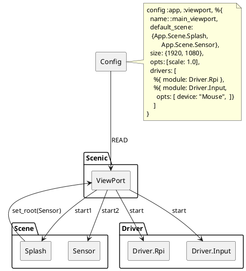
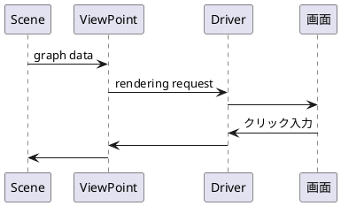
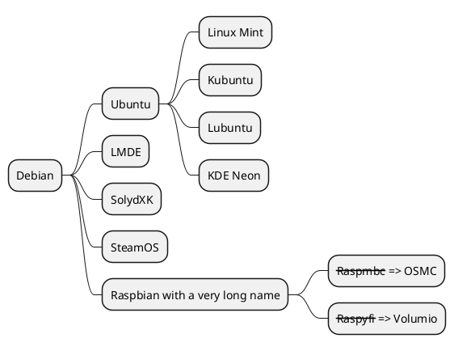

Title: \[Elixir/Nerves\] UIフレームワークScenicの仕組みと考察
-----

[1. はじめに](#item_1)

[2. Scenicとは](#item_2)

[3. 特徴](#item_3)

[4. モジュール構成](#item_4)

[5. 起動と動作](#item_5)

[6. 課題](#item_6)

[7. まとめ](#item_7)


<a id="item_1"></a>

1. はじめに
-----
<a id="item_2"></a>

2. Scenicとは
-----
**Scenic**はElixir上で動作するUIフレームワークです。

<a id="item_3"></a>

3. 特徴
----

* Small Fast
スモールで速い: ブラウザー150MB以上が必要、Scenic:20〜30MB
* 自立した機能:
* 保守が容易:
* 遠隔制御
* 再利用
* 柔軟
* 安全

\ ではない
* ウェブブラウザーではない
* 3Dフレームではない: 2Dフレーム
* (直接描画)Immediate Modeではない


4. 構造
----
Scenic/NervesのDemo版のブロック図


Scenicの起動は`config :app, :viewport %{}` の設定をScenicモジュールが入力し、それに従い、各モジュールを起動している。


Scene

ViewPort
----
役割はscenesとdrivers間の情報の流れの交通整理する事。ScenesとDriversはお互いに何も知る必要がない。APPは動いているDriverがひとつ、複数、また無かろうが、個別に動く。  
driversは

Driver
----


Graph
----
Sceneの役割の一番重要な状態はこのGraphである。

Text is a *Primitive*, which can be drawn directly to the screen. The *test/3* helper function
is imported fromt the `Scenic.Proimitives` module. Button is a [component]() whose helper function
is imported from the `Scenic.Components` module.

```
defmodule MyApp.Scene.Example do 
  use Scenic.Scene
  alias Scenic.Graph
  alias Scenic.Primitives
  alias Scenic.Components

  @graph Graph.build()
        |> text("Hello World", font_size: 22, translate: {20, 80})
        |> button({"Do Something", :btn_something}, translate: {20,180})

  def init(_scene_args, _options) do
    {:ok, @graph, push: @graph}
  end

```
If you can, build your graphs at compile time instead of at run time. This both reduces
load/power use on the device and surface any errors early instead of when the device is in
use. In the exmaple above, the graph is built at compile time by assigning it to the module
attribute `@graph`. 

Initialization
-----

User Input
----




<!-- ```plantuml
@startuml
:<math>int_0^1f(x)dx</math>;
:<math>x^2+y_1+z_12^34</math>;
note right
Try also
<math>d/dxf(x)=lim_(h->0)(f(x+h)-f(x))/h</math>
<latex>P(y|\mathbf{x}) \mbox{ or } f(\mathbf{x})+\epsilon</latex>
end note
@enduml
``` -->

<!-- MindMapのplantuml
-----

Scenic.Cache.Static.Texture   # for image files (static images)
Scenic.Cache.Static.FontMetrics   # ont metrics for working with strings
Scenic.Cache.Static.Font      # custom fonts you may want to use
Scenic.Cache.Dynamic.Texture  # for image fills (changing images)
```

Static vs Dynamic assets
-----
As you look at the asset types. take special note that they are static or dynamic in nature.
The static assets require and enforce a hash as the key to the assets. This is both protects the contents against unwanted change, and allows for a very efficient way to reference these items both within a single machine and across the Internet.

The **dynamic** assets can have any string you desire as the key and are not cached across machines as they changing in nature. If you are capturing images from a camera and displaying it in a scene, you will want to put it in the dynamic texture cache.


