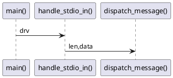

src architecture
-----

| file  | func | explanation |
|-------|------|------|
| main.c | init_video_core() | setup the video core  |
|   | test_draw() |       |
|   | isCallerDown() |       |
|   | main()      |       |
| comms.c | test_endian() |  |
|   | read_exact() |   |
|   | write_exact() |  |
|   | write_cmd() |   |
|   | read_msg_length() |  |
|   | read_bytes_down() |  |
|   | send_puts() |  |
|   | send_write() |  |
|   | send_inspect() |  |
|   | send_static_texture_miss() |  |
|   | send_dynamic_texture_miss() |   |
|   | send_font_miss() |   |
|   | send_key() |   |
|   | send_codepoint() |   |
|   | send_cursor_pos() |   |
|   | send_mouse_button() |   |
|   | send_scroll() |  |
|   | send_cursor_enter() |  |
|   | send_close() | MSG_OUT_CLOSE(0x00) write |
|   | send_ready() |  |
|   | send_draw_ready() |  |
|   | receive_query_stats() |  |
|   | receive_quit() |  |
|   | receive_crash() |  |
|   | receive_render() |  |
|   | receive_clear() |  |
|   | receive_set_root() |  |
|   | receive_clear_color() |  |
|   | receive_load_font_file() |  |
|   | receive_load_font_blob() |  |
|   | dispatch_message() |  |
|   | handle_stdio_in() |  |
|   | () |  |

dispatch_message()
------
| Msg ID | func | expl | note |
|--------|------|------| -----|
| CMD_QUIT | receive_quit() |   |  |
| CMD_RENDER_GRAPH | receive_render() |   |  |
| CMD_CLEAR_GRAPH | receive_clear() |   |  |
| CMD_SET_ROOT | receive_set_root() |   |  |
| CMD_CLEAR_COLOR | receive_clear_color() |   |  |
| ~~CMD_INPUT~~ | receive_input() |   |  |
| CMD_QUERY_STATS | receive_query_stats() |   |  |
| CMD_LOAD_FONT_FILE | receive_load_font_file() |   |  |
| CMD_LOAD_FONT_BLOB | receive_load_font_blob() |   |  |
| CMD_PUT_TX_BLOB | receive_put_tx_blob() |   |  |
| CMD_FREE_TX_ID | receive_free_tx_id() |   |  |
| CMD_CRASH | receive_crash() |   |  |

